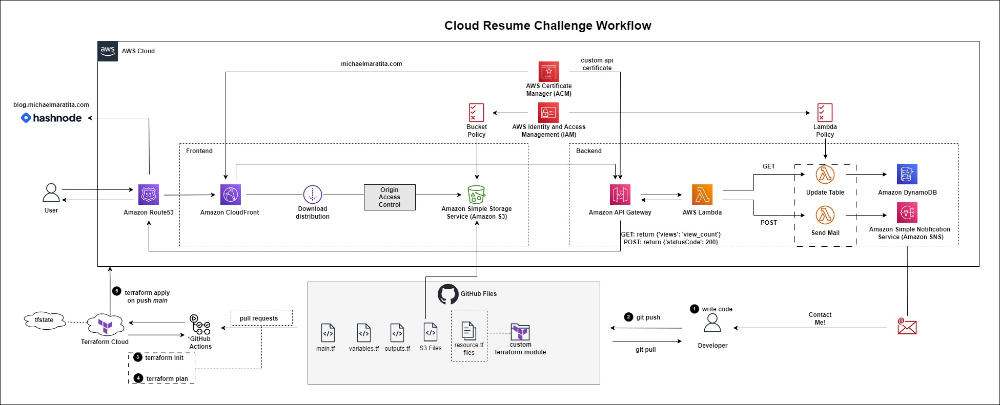

# Template for S3 Static Website

This repo provides the basic folder structure for deploying a highly available static website, as seen above, utilizing various AWS services, including Amazon Simple Storage Service (S3), Amazon CloudFront, Amazon DynamoDB and Amazon Simple Notification Service (SNS). The repo also provides GitHub Actions workflows for planning, appyling, and destroying your infrastructure. The workflows are currently configured to run manually, but can easily be modified by uncommenting the `on:` actions. 

I will guide you through my implementation of the creating the static website, and utilizing those services. You can follow along in the steps [here](./steps/step_1.md) or on my [blog](https://blog.michaelmaratita.com).